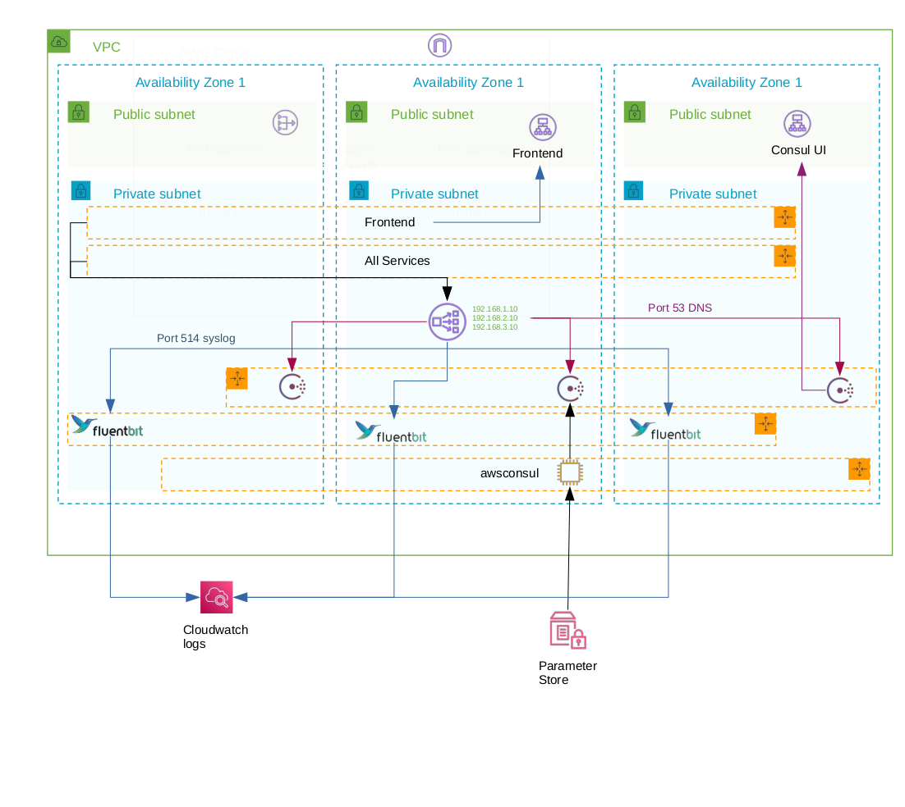

# Google Cloud Microservices Demo... running on AWS with NanoVMs

This project was used to explore [NanoVMs](https://github.com/nanovms), in an effort to explore 
simpler safer and more secure deployments in the Cloud.

## Quick Start

To deploy you need to create an S3 bucket in your target account, and export the bucket name.

```bash
export BUCKET=mybucketname
```

Export your AWS credentials to
[AWS Environment variables](https://docs.aws.amazon.com/cli/latest/userguide/cli-configure-envvars.html).

**This repo is set for eu-west-1**

Build your images:
```bash
make buildall
```
Deploy your stack:
```bash
make deploy
```
Destroy your stack:
```bash
make destroy
```
The system also creates AMIs and Snapshots, so you may want to clean those up.

You delete all AMIs with the tag "CreatedBy=Ops"

```bash
make cleanamis
```

The output from deploy will print a url for Consul, and a URL for the Boutique shop.

## Description

Originally this was going to be deployed with [the socks shop](https://github.com/microservices-demo),
but it had some very old Node libraries I had no ambition to fix.

I think this is an adequate demo demonstration as it takes a system built for Kubernetes and
ports it to unikernels designed to be run natively in the cloud.

This project clones all the applications from the src directory in the 
[GoogleCloudPlatform microservices-demo](https://github.com/GoogleCloudPlatform/microservices-demo)
and builds unikernel vms for AWS.

## Architecture




## Applications

The build for all applications are defined in the images folder and the scripts folder. No source code in 
the microservices demo is captured here. All vms are built in the docker containers.

[ops](https://github.com/nanovms/ops) cannot normally run images in containers but it can build and deliver them to a cloud provider.

All the applications from microservices-demo reference a specific git commit to avoid breaking changes from the source repository.

Notes for all repositories:
- Consul is used for service discovery with DNS and they applications
get a resolv.conf in etc that points to an internal NLB that has static IPS. The NLB targets a Consul cluster.
- All services that need to be discovered come with a ```consul.json``` which defines a Consul Service. This
is autoloaded into AWs Parameter store and eventually pushed into Consul. All Consul features of a service
including healthchecks are supported.
- Every application has a ```config.json```, which tells ops how to build the vms and where to put it.
- Every folder has a ```Dockerfile``` that builds the AWS AMIs.


Notes on the applications
- **adservice:**
	- Built on Gradle.
	- Gradle generates a bash script that is used to launch the app. The arguments are extraccted from
this bash script and added to the arguments of the ```config.json```. Bash is not a thing in Unikernels.
- **asgtoconsul:**
	- Built on Go.
	- This application scans EC2 tags for key ```consulcloud``` with value ```service```.  Returned instances
then look for a parameter store value under the tag key ```consulserviceconfig``` which references a parameter store.
The parameter store is the Consul Service config.  The IP Address, Instance name and "HEALTHROUTE" is repaced with the 
InstanceId.
	- This may be broken into another repo... I like it.
- **cartservice:**
	- Built on Dotnet.
	- "InvariantGlobalization" is injected to make it work.
- **checkoutservice:**
	- Built on Go
- **consul:**
	- This demonstrates how to build a package, the most current version of Consul was not available through NanoVMs
- **currencyservice:**
	- Built on NodeJS
- **emailservice:**
	- Built on Python 3.8
	- This has a patch because the Google version built on 3.7 uses a log format not supported in 3.8
- **fluentbit:**
	- This demonstrates how to build a package, FluentBit was not available on NanoVMs.
	- This is a work in progress as a log runner for NanoVMs
- **frontend:**
	- Built on Go
- **paymentservice:**
	- Built on NodeJS
- **productcatalogservice:**
	- Built on Go
- **recommendationservice:**
	- Built on Python 3.8
	- This has a patch because the Google version built on 3.7 uses a log format not supported in 3.8
- **shippingservice:**
	- Built on Go

## Deployment

Deployment is done with [sceptre](https://github.com/Sceptre/sceptre), but from within a Docker container.

Sceptre uses Cloudformation templates in the templates folder and stores its per environment configuration
in the config folder.

## Bugs

- Consul derives its name from its hostname.  Currently all NanoVMS get a static hostname called "nanovms". There is an 
[issue](https://github.com/nanovms/nanos/issues/1655) for that. That means currently we just build three separate 
AMIs and are limioted to 3 consul instances.
- Ops has an [issue](https://github.com/nanovms/ops/issues/1244) with large AWS AMIs. Ops is run in a container. The container
has a regular version and "opssafe" version that deal with the issue with large images.  You can view the [Dockerfile](Dockerfile)
to perform your own build.

